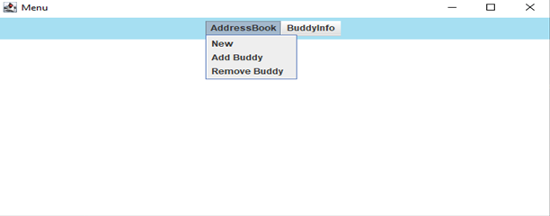
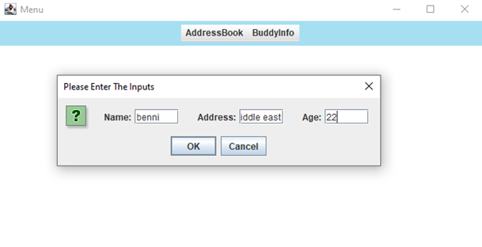
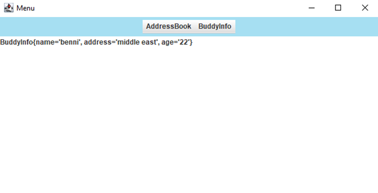
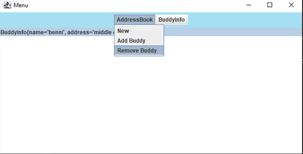
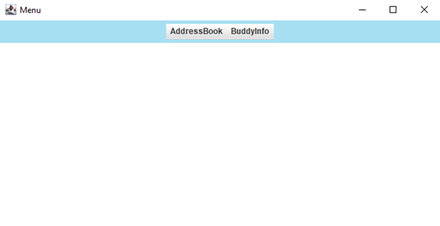

# MenuGUI

A GUI written in Java

# Interface
* Menu Properties

   

# Adding Property
* Create a BuddyInfo object based on the user input and update the GUI

   
  

# Remove Property
* Remove a BuddyInfo object based on the selected object and update the GUI

   
  

